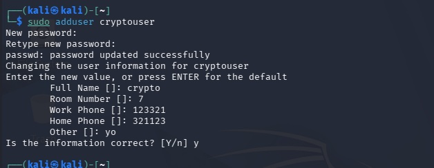
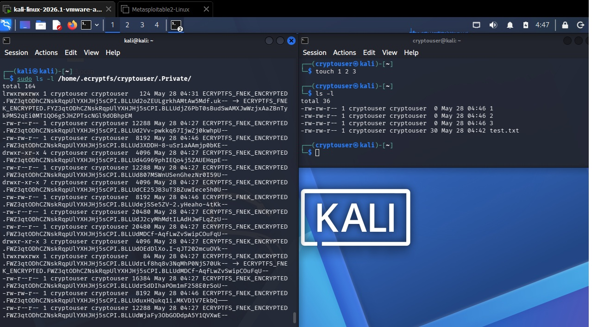
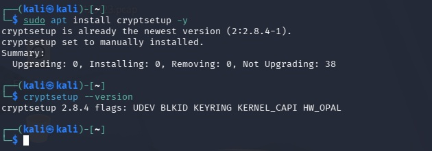
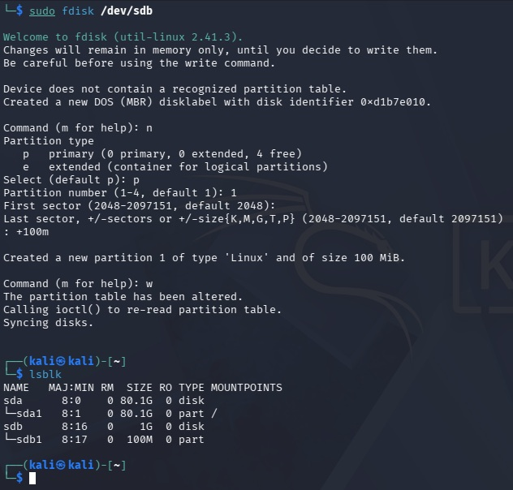
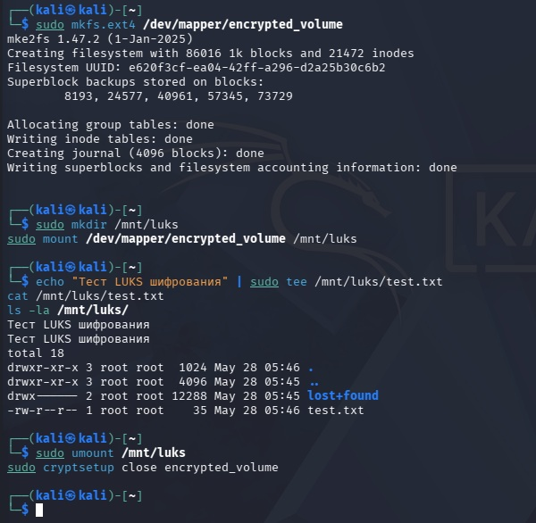

# Домашнее задание к занятию "`Защита хоста`" - `Chernov Vyacheslav`

## Задание 1

1. Установите eCryptfs.
2. Добавьте пользователя cryptouser.
3. Зашифруйте домашний каталог пользователя с помощью eCryptfs.

В качестве ответа пришлите снимки экрана домашнего каталога пользователя с исходными и зашифрованными данными.

# Решение

Установленно: eCryptfs в Kali linux.
Пользователь cryptouser добавлен

Домашний каталог зашифрован.

## Задание 2

1. Установите поддержку LUKS.
2. Создайте небольшой раздел, например, 100 Мб.
3. Зашифруйте созданный раздел с помощью LUKS.

В качестве ответа пришлите снимки экрана с поэтапным выполнением задания.

# Решение

Установите поддержку LUKS.

Создайте небольшой раздел, например, 100 Мб.

Зашифруйте созданный раздел с помощью LUKS.

